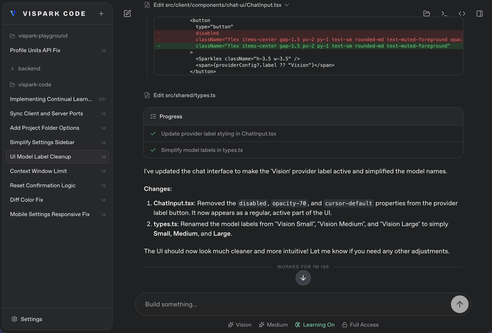

<p align="center">
  
</p>

<h1 align="center">Vispark Code</h1>

<p align="center">
  <strong>A local-first coding assistant powered by Vision AI</strong>
</p>

<p align="center">
  <picture>
    <source media="(prefers-color-scheme: dark)" srcset="assets/screenshot.png" />
    <source media="(prefers-color-scheme: light)" srcset="assets/screenshot-light.png" />
    
  </picture>
</p>

## Quickstart

```bash
bun install
bun run build
bun run start
```

Or install the CLI globally:

```bash
bun install -g vispark-code
vispark-code                # start with defaults (localhost only)
vispark-code --port 4000    # custom port
vispark-code --no-open      # don't open browser
vispark-code --share        # create a public share URL + terminal QR
```

Vispark Code opens at `http://localhost:3210`.

## What It Is

- A polished local coding assistant
- Vision AI as the model backend
- Continual Learning Available
- An optamised harness
- Built-in Vispark Lab API key settings
- Project-first chats, tool flows, plan mode, and embedded terminal support

## Local Data

Vispark Code stores state in `~/.vispark-code/data/`.

### Public share link

Use `--share` to create a temporary public `trycloudflare.com` URL and print a terminal QR code:

```bash
vispark-code --share
vispark-code --share --port 4000
```

`--share` is incompatible with `--host` and `--remote`. It does not open a browser automatically; instead it prints:

```text
QR Code:
...

Public URL:
https://<random>.trycloudflare.com

Local URL:
http://localhost:3210
```

## Development

```bash
bun run dev
```

Useful commands:
The same `--remote` and `--host` flags can be used with `bun run dev` for remote development.
`--share` is also supported in dev mode and exposes the Vite client URL publicly:

```bash
bun run dev --share
bun run dev --port 3333 --share
```

In dev, `--port` sets the Vite client port and the backend runs on `port + 1`, so `bun run dev --port 3333 --share` publishes `http://localhost:3333`.
`--share` remains incompatible with `--host` and `--remote`.
Use `bun run dev --port 4000` to run the Vite client on `4000` and the backend on `4001`.

```bash
bun run check
bun test
bun run dev:client
bun run dev:server
bun run sync:sources
```

For network access, Vispark Code binds to `127.0.0.1` by default. Use `--host <hostname-or-ip>` to bind a specific interface, or `--remote` to bind `0.0.0.0`.

```bash
vispark-code --remote
vispark-code --host dev-box
vispark-code --host 192.168.1.x
```

The same host flags work in development, and `bun run dev --port 4000` runs the Vite client on `4000` and the backend on `4001`.

## Project Structure

```text
src/
  client/   React UI
  server/   Bun server, runtime bridge, Vision proxy
  shared/   Shared types and branding
```

## Safe Source Sync

Vispark Code keeps package self-updates for installed users.

- Your custom project files are not auto-overwritten.
- Sync state is stored in `~/.vispark-code/data/source-sync.json`.
- Set `VISPARK_CODE_DISABLE_SOURCE_SYNC=1` if you want to turn that off.
